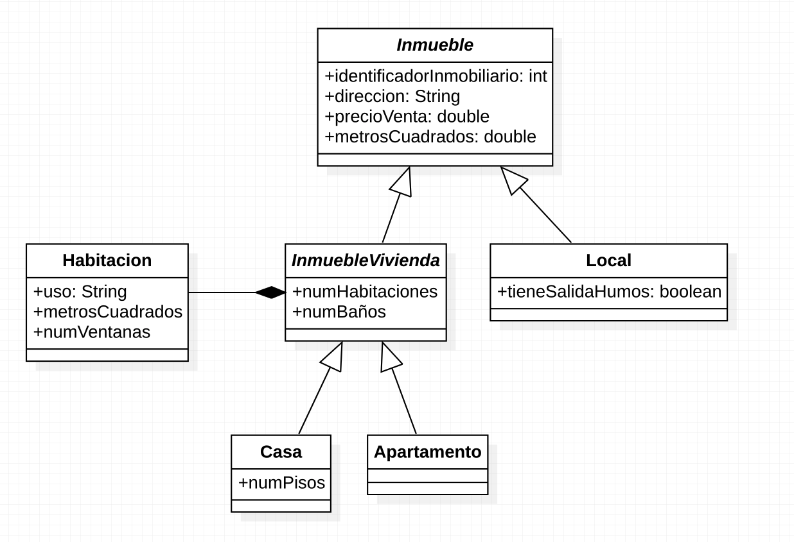

# Sección 3 - Asociaciones y herencia

## Ejercicios resueltos en vídeo

Nos han solicitado una aplicación para gestionar algunos datos de una inmobiliaria. 

- Esta tiene una serie de inmuebles. De cada uno de ellos queremos saber: identificador inmobiliario (entero), dirección, precio de venta y los metros cuadrados. Esta clase será abstracta.
- Los inmuebles pueden ser de tipo Local u orientados a ser una vivienda.
- De cada Local queremos saber si tiene salida de humos o no la tiene (booleano).
- De cada inmueble orientado a ser una vivienda queremos saber el número de habitaciones y el número de baños, además de las habitaciones que tiene. Esta clase será abstracta.
- De cada Habitación queremos saber los metros cuadrados, el número de ventanas y el uso que se le va a dar (dormitorio, salón, despacho, vestidor, …)
- Los InmueblesVivienda pueden ser de dos tipos: Casa y Apartamento. De las casas queremos saber cuántos pisos (plantas en altura) tiene.
- De cada clase se necesita: constructores, getters/setters, equals, hashCode y toString.
- El modelo de herencia no debe ser extensible → clases selladas.

Implementar además un main con algunas viviendas de ejemplo.

<center></center>

Puedes encontrar el código fuente completo de este ejercicio resuelto en vídeo [aquí](../../Ejemplos/03.7_Ejercicio01/)

También lo tienes disponible a continuación:

`Inmueble.java`
```java
package herencia;

import java.util.Objects;

public abstract sealed class Inmueble permits Local, InmuebleVivienda {
	
	protected int identificadorInmobiliario;
	protected String direccion;
	protected double precioVenta;
	protected double metrosCuadrados;
	
	public Inmueble() { }
	
	public Inmueble(int identificadorInmobiliario, String direccion, double precioVenta, double metrosCuadrados) {
		this.identificadorInmobiliario = identificadorInmobiliario;
		this.direccion = direccion;
		this.precioVenta = precioVenta;
		this.metrosCuadrados = metrosCuadrados;
	}

	public int getIdentificadorInmobiliario() {
		return identificadorInmobiliario;
	}

	public String getDireccion() {
		return direccion;
	}

	public double getPrecioVenta() {
		return precioVenta;
	}

	public double getMetrosCuadrados() {
		return metrosCuadrados;
	}

	public void setIdentificadorInmobiliario(int identificadorInmobiliario) {
		this.identificadorInmobiliario = identificadorInmobiliario;
	}

	public void setDireccion(String direccion) {
		this.direccion = direccion;
	}

	public void setPrecioVenta(double precioVenta) {
		this.precioVenta = precioVenta;
	}

	public void setMetrosCuadrados(double metrosCuadrados) {
		this.metrosCuadrados = metrosCuadrados;
	}

	@Override
	public int hashCode() {
		return Objects.hash(direccion, identificadorInmobiliario, metrosCuadrados, precioVenta);
	}

	@Override
	public boolean equals(Object obj) {
		if (this == obj)
			return true;
		if (obj == null)
			return false;
		if (getClass() != obj.getClass())
			return false;
		Inmueble other = (Inmueble) obj;
		return Objects.equals(direccion, other.direccion)
				&& identificadorInmobiliario == other.identificadorInmobiliario
				&& Double.doubleToLongBits(metrosCuadrados) == Double.doubleToLongBits(other.metrosCuadrados)
				&& Double.doubleToLongBits(precioVenta) == Double.doubleToLongBits(other.precioVenta);
	}

	@Override
	public String toString() {
		return "Inmueble [identificadorInmobiliario=" + identificadorInmobiliario + ", direccion=" + direccion
				+ ", precioVenta=" + precioVenta + ", metrosCuadrados=" + metrosCuadrados + "]";
	}

}
```

`Local.java`
```java
package herencia;

import java.util.Objects;

public final class Local extends Inmueble {
	
	private boolean tieneSalidaHumos;

	
	public Local() { }
	
	public Local(int identificadorInmobiliario, String direccion, double precioVenta, double metrosCuadrados,
			boolean tieneSalidaHumos) {
		super(identificadorInmobiliario, direccion, precioVenta, metrosCuadrados);
		this.tieneSalidaHumos = tieneSalidaHumos;
	}

	public boolean isTieneSalidaHumos() {
		return tieneSalidaHumos;
	}

	public void setTieneSalidaHumos(boolean tieneSalidaHumos) {
		this.tieneSalidaHumos = tieneSalidaHumos;
	}
	
	@Override
	public int hashCode() {
		final int prime = 31;
		int result = super.hashCode();
		result = prime * result + Objects.hash(tieneSalidaHumos);
		return result;
	}

	@Override
	public boolean equals(Object obj) {
		if (this == obj)
			return true;
		if (!super.equals(obj))
			return false;
		if (getClass() != obj.getClass())
			return false;
		Local other = (Local) obj;
		return tieneSalidaHumos == other.tieneSalidaHumos;
	}

	@Override
	public String toString() {
		return "Local [tieneSalidaHumos=" + tieneSalidaHumos + ", identificadorInmobiliario="
				+ identificadorInmobiliario + ", direccion=" + direccion + ", precioVenta=" + precioVenta
				+ ", metrosCuadrados=" + metrosCuadrados + "]";
	}

}

```


`InmuebleVivienda.java`
```java
package herencia;

import java.util.Arrays;
import java.util.Objects;

public sealed abstract class InmuebleVivienda extends Inmueble permits Casa, Apartamento {

	private static final int MIN_SIZE_HABITACION = 3;

	protected Habitacion[] habitaciones;
	protected int numHabitaciones;
	protected int numBanios;
	

	public InmuebleVivienda() {
		super();
		habitaciones = new Habitacion[MIN_SIZE_HABITACION];
		numHabitaciones = 0;
	}
	
	public InmuebleVivienda(int identificadorInmobiliario, String direccion, double precioVenta, double metrosCuadrados,
			Habitacion[] habitaciones, int numHabitaciones, int numBanios) {
		super(identificadorInmobiliario, direccion, precioVenta, metrosCuadrados);
		// clonamos el array para obtener una copia limpia
		this.habitaciones = habitaciones.clone();
		this.numHabitaciones = habitaciones.length;
		this.numBanios = numBanios;
	}

	public Habitacion[] getHabitaciones() {
		// Devolvemos una copia y evitamos
		// que se pueda modificar desde fuera
		// de la clase
		return habitaciones.clone();
	}
	
	public void addHabitacion(Habitacion h) {
		if (habitaciones.length == numHabitaciones) {
			habitaciones = Arrays.copyOf(habitaciones, habitaciones.length+1);			
		}
		habitaciones[numHabitaciones++] = h;
	}
	
	public void removeHabitacion(int index) {
		if (index > 0 && index < numHabitaciones) {
			habitaciones[index] = null;
			for(int i = index+1; i < numHabitaciones-1; i++) {
				habitaciones[i] = habitaciones[i+1];
			}
			numHabitaciones--;
		}
	}

	public int getNumHabitaciones() {
		return numHabitaciones;
	}

	public int getNumBanios() {
		return numBanios;
	}

	public void setNumHabitaciones(int numHabitaciones) {
		this.numHabitaciones = numHabitaciones;
	}

	public void setNumBanios(int numBanios) {
		this.numBanios = numBanios;
	}

	@Override
	public int hashCode() {
		final int prime = 31;
		int result = super.hashCode();
		result = prime * result + Arrays.hashCode(habitaciones);
		result = prime * result + Objects.hash(numBanios, numHabitaciones);
		return result;
	}

	@Override
	public boolean equals(Object obj) {
		if (this == obj)
			return true;
		if (!super.equals(obj))
			return false;
		if (getClass() != obj.getClass())
			return false;
		InmuebleVivienda other = (InmuebleVivienda) obj;
		return Arrays.equals(habitaciones, other.habitaciones) && numBanios == other.numBanios
				&& numHabitaciones == other.numHabitaciones;
	}

	@Override
	public String toString() {
		return "InmuebleVivienda [habitaciones=" + Arrays.toString(habitaciones) + ", numHabitaciones="
				+ numHabitaciones + ", numBanios=" + numBanios + ", identificadorInmobiliario="
				+ identificadorInmobiliario + ", direccion=" + direccion + ", precioVenta=" + precioVenta
				+ ", metrosCuadrados=" + metrosCuadrados + "]";
	}
}

```

`Casa.java`
```java
package herencia;

import java.util.Arrays;
import java.util.Objects;

public final class Casa extends InmuebleVivienda {
	
	private int numPisos;
	
	public Casa() {
		super();
	}

	public Casa(int identificadorInmobiliario, String direccion, double precioVenta, double metrosCuadrados,
			Habitacion[] habitaciones, int numHabitaciones, int numBanios, int numPisos) {
		super(identificadorInmobiliario, direccion, precioVenta, metrosCuadrados, habitaciones, numHabitaciones,
				numBanios);
		this.numPisos = numPisos;
	}

	public int getNumPisos() {
		return numPisos;
	}

	public void setNumPisos(int numPisos) {
		this.numPisos = numPisos;
	}

	@Override
	public int hashCode() {
		final int prime = 31;
		int result = super.hashCode();
		result = prime * result + Objects.hash(numPisos);
		return result;
	}

	@Override
	public boolean equals(Object obj) {
		if (this == obj)
			return true;
		if (!super.equals(obj))
			return false;
		if (getClass() != obj.getClass())
			return false;
		Casa other = (Casa) obj;
		return numPisos == other.numPisos;
	}

	@Override
	public String toString() {
		return "Casa [numPisos=" + numPisos + ", habitaciones=" + Arrays.toString(habitaciones) + ", numHabitaciones="
				+ numHabitaciones + ", numBanios=" + numBanios + ", identificadorInmobiliario="
				+ identificadorInmobiliario + ", direccion=" + direccion + ", precioVenta=" + precioVenta
				+ ", metrosCuadrados=" + metrosCuadrados + "]";
	}	

}

```

`Habitacion.java`
```java
package herencia;

import java.util.Objects;

public class Habitacion {
	
	private String uso;
	private double metrosCuadrados;
	private int numVentanas;
	
	public Habitacion() {}
	
	public Habitacion(String uso, double metrosCuadrados, int numVentanas) {
		super();
		this.uso = uso;
		this.metrosCuadrados = metrosCuadrados;
		this.numVentanas = numVentanas;
	}

	public String getUso() {
		return uso;
	}

	public double getMetrosCuadrados() {
		return metrosCuadrados;
	}

	public int getNumVentanas() {
		return numVentanas;
	}

	public void setUso(String uso) {
		this.uso = uso;
	}

	public void setMetrosCuadrados(double metrosCuadrados) {
		this.metrosCuadrados = metrosCuadrados;
	}

	public void setNumVentanas(int numVentanas) {
		this.numVentanas = numVentanas;
	}

	@Override
	public int hashCode() {
		return Objects.hash(metrosCuadrados, numVentanas, uso);
	}

	@Override
	public boolean equals(Object obj) {
		if (this == obj)
			return true;
		if (obj == null)
			return false;
		if (getClass() != obj.getClass())
			return false;
		Habitacion other = (Habitacion) obj;
		return Double.doubleToLongBits(metrosCuadrados) == Double.doubleToLongBits(other.metrosCuadrados)
				&& numVentanas == other.numVentanas && Objects.equals(uso, other.uso);
	}

	@Override
	public String toString() {
		return "Habitacion [uso=" + uso + ", metrosCuadrados=" + metrosCuadrados + ", numVentanas=" + numVentanas + "]";
	}
	

}

```

`Apartamento.java`
```java
package herencia;

public final class Apartamento extends InmuebleVivienda {

	public Apartamento() {
		super();
	}

	public Apartamento(int identificadorInmobiliario, String direccion, double precioVenta, double metrosCuadrados,
			Habitacion[] habitaciones, int numHabitaciones, int numBanios) {
		super(identificadorInmobiliario, direccion, precioVenta, metrosCuadrados, habitaciones, numHabitaciones, numBanios);
	}
	
	

}

```

`App.java`
```java
package herencia;

public class App {

	public static void main(String[] args) {
		
		Local l1 = new Local(1, "C/ Rue del Percebe nº 1", 250000.0, 110, true);
		
		System.out.println(l1);
		
		Casa c1 = new Casa();
		c1.setIdentificadorInmobiliario(2);
		c1.setDireccion("C/ Rue del Percebe 2");
		c1.setPrecioVenta(150000);
		c1.setMetrosCuadrados(70);
		c1.setNumBanios(2);
		c1.addHabitacion(new Habitacion("Dormitorio", 13, 1));
		c1.addHabitacion(new Habitacion("Dormitorio", 16, 1));
		c1.addHabitacion(new Habitacion("Salón", 18, 2));
		c1.setNumPisos(1);
		
		System.out.println(c1);
		
		

	}

}

```

2. Partimos de la solución al ejercicio anterior. El gobierno aplica algunos impuestos al precio de venta de los inmuebles.

- En el caso de los Locales, el precio de venta se ve incrementado con un determinado porcentaje de plusvalía. El porcentaje depende de la localidad y se debe recibir en el constructor.
- Para los InmuebleVivienda, el impuesto que se paga es el IVA del 21%.

Implementa un método que nos indique el precio final de venta aplicando los impuestos.

Añade además un método estático a la clase `Main` que reciba un `Inmueble` y muestre su información. Su comportamiento será diferente en función del tipo de inmueble. Para todos se mostrará el precio final, y además:

* Para los locales, se mostrará nada más su dirección, los m2 y si tiene salida de humos.
* Para las casas, se mostrará su dirección, los m2, el nº de habitaciones y el nº de plantas o pisos.
* Para los apartamentos, se mostrará la dirección, los m2 y el nº de habitaciones.

Puedes encontrar el código fuente completo de este ejercicio resuelto en vídeo [aquí](../../Ejemplos/03.8_Ejercicio2/)

También lo tienes disponible a continuación:

`Inmueble.java`
```java
package herencia;

import java.util.Objects;

public abstract sealed class Inmueble permits Local, InmuebleVivienda {
	
	protected int identificadorInmobiliario;
	protected String direccion;
	protected double precioBase;
	protected double metrosCuadrados;
	
	public Inmueble() { }
	
	public Inmueble(int identificadorInmobiliario, String direccion, double precioBase, double metrosCuadrados) {
		this.identificadorInmobiliario = identificadorInmobiliario;
		this.direccion = direccion;
		this.precioBase = precioBase;
		this.metrosCuadrados = metrosCuadrados;
	}

	public int getIdentificadorInmobiliario() {
		return identificadorInmobiliario;
	}

	public String getDireccion() {
		return direccion;
	}

	public double getPrecioBase() {
		return precioBase;
	}

	public double getMetrosCuadrados() {
		return metrosCuadrados;
	}

	public void setIdentificadorInmobiliario(int identificadorInmobiliario) {
		this.identificadorInmobiliario = identificadorInmobiliario;
	}

	public void setDireccion(String direccion) {
		this.direccion = direccion;
	}

	public void setPrecioBase(double precioBase) {
		this.precioBase = precioBase;
	}

	public void setMetrosCuadrados(double metrosCuadrados) {
		this.metrosCuadrados = metrosCuadrados;
	}
	
	public abstract double precioVentaFinal();

	@Override
	public int hashCode() {
		return Objects.hash(direccion, identificadorInmobiliario, metrosCuadrados, precioBase);
	}

	@Override
	public boolean equals(Object obj) {
		if (this == obj)
			return true;
		if (obj == null)
			return false;
		if (getClass() != obj.getClass())
			return false;
		Inmueble other = (Inmueble) obj;
		return Objects.equals(direccion, other.direccion)
				&& identificadorInmobiliario == other.identificadorInmobiliario
				&& Double.doubleToLongBits(metrosCuadrados) == Double.doubleToLongBits(other.metrosCuadrados)
				&& Double.doubleToLongBits(precioBase) == Double.doubleToLongBits(other.precioBase);
	}

	@Override
	public String toString() {
		return "Inmueble [identificadorInmobiliario=" + identificadorInmobiliario + ", direccion=" + direccion
				+ ", precioBase=" + precioBase + ", metrosCuadrados=" + metrosCuadrados + "]";
	}
}

```

`Local.java`
```java
package herencia;

import java.util.Objects;

public final class Local extends Inmueble {
	
	private boolean tieneSalidaHumos;
	private double porcentajePlusvalia;

	
	public Local() { }
	
	

	public Local(int identificadorInmobiliario, String direccion, double precioBase, double metrosCuadrados,
			boolean tieneSalidaHumos, double porcentajePlusvalia) {
		super(identificadorInmobiliario, direccion, precioBase, metrosCuadrados);
		this.tieneSalidaHumos = tieneSalidaHumos;
		this.porcentajePlusvalia = porcentajePlusvalia;
	}


	public boolean isTieneSalidaHumos() {
		return tieneSalidaHumos;
	}

	public void setTieneSalidaHumos(boolean tieneSalidaHumos) {
		this.tieneSalidaHumos = tieneSalidaHumos;
	}

	public double getPorcentajePlusvalia() {
		return porcentajePlusvalia;
	}

	public void setPorcentajePlusvalia(double porcentajePlusvalia) {
		this.porcentajePlusvalia = porcentajePlusvalia;
	}

	@Override
	public double precioVentaFinal() {
		// El % está expresado entre 0 y 1
		return this.precioBase * (1 + this.porcentajePlusvalia);
	}

	@Override
	public int hashCode() {
		final int prime = 31;
		int result = super.hashCode();
		result = prime * result + Objects.hash(tieneSalidaHumos);
		return result;
	}

	@Override
	public boolean equals(Object obj) {
		if (this == obj)
			return true;
		if (!super.equals(obj))
			return false;
		if (getClass() != obj.getClass())
			return false;
		Local other = (Local) obj;
		return tieneSalidaHumos == other.tieneSalidaHumos;
	}

	@Override
	public String toString() {
		return "Local [tieneSalidaHumos=" + tieneSalidaHumos + ", identificadorInmobiliario="
				+ identificadorInmobiliario + ", direccion=" + direccion + ", precioVenta=" + precioBase
				+ ", metrosCuadrados=" + metrosCuadrados + "]";
	}

}

```

`InmuebleVivienda.java`
```java
package herencia;

import java.util.Arrays;
import java.util.Objects;

public sealed abstract class InmuebleVivienda extends Inmueble permits Casa, Apartamento {

	private static final int MIN_SIZE_HABITACION = 3;

	protected Habitacion[] habitaciones;
	protected int numHabitaciones;
	protected int numBanios;
	

	public InmuebleVivienda() {
		super();
		habitaciones = new Habitacion[MIN_SIZE_HABITACION];
		numHabitaciones = 0;
	}
	
	public InmuebleVivienda(int identificadorInmobiliario, String direccion, double precioVenta, double metrosCuadrados,
			Habitacion[] habitaciones, int numHabitaciones, int numBanios) {
		super(identificadorInmobiliario, direccion, precioVenta, metrosCuadrados);
		// clonamos el array para obtener una copia limpia
		this.habitaciones = habitaciones.clone();
		this.numHabitaciones = habitaciones.length;
		this.numBanios = numBanios;
	}

	public Habitacion[] getHabitaciones() {
		// Devolvemos una copia y evitamos
		// que se pueda modificar desde fuera
		// de la clase
		return habitaciones.clone();
	}
	
	public void addHabitacion(Habitacion h) {
		if (habitaciones.length == numHabitaciones) {
			habitaciones = Arrays.copyOf(habitaciones, habitaciones.length+1);			
		}
		habitaciones[numHabitaciones++] = h;
	}
	
	public void removeHabitacion(int index) {
		if (index > 0 && index < numHabitaciones) {
			habitaciones[index] = null;
			for(int i = index+1; i < numHabitaciones-1; i++) {
				habitaciones[i] = habitaciones[i+1];
			}
			numHabitaciones--;
		}
	}

	public int getNumHabitaciones() {
		return numHabitaciones;
	}

	public int getNumBanios() {
		return numBanios;
	}

	public void setNumHabitaciones(int numHabitaciones) {
		this.numHabitaciones = numHabitaciones;
	}

	public void setNumBanios(int numBanios) {
		this.numBanios = numBanios;
	}
	
	
	
	
	@Override
	public double precioVentaFinal() {
		return this.precioBase * 1.21;
	}

	@Override
	public int hashCode() {
		final int prime = 31;
		int result = super.hashCode();
		result = prime * result + Arrays.hashCode(habitaciones);
		result = prime * result + Objects.hash(numBanios, numHabitaciones);
		return result;
	}

	@Override
	public boolean equals(Object obj) {
		if (this == obj)
			return true;
		if (!super.equals(obj))
			return false;
		if (getClass() != obj.getClass())
			return false;
		InmuebleVivienda other = (InmuebleVivienda) obj;
		return Arrays.equals(habitaciones, other.habitaciones) && numBanios == other.numBanios
				&& numHabitaciones == other.numHabitaciones;
	}

	@Override
	public String toString() {
		return "InmuebleVivienda [habitaciones=" + Arrays.toString(habitaciones) + ", numHabitaciones="
				+ numHabitaciones + ", numBanios=" + numBanios + ", identificadorInmobiliario="
				+ identificadorInmobiliario + ", direccion=" + direccion + ", precioBase=" + precioBase
				+ ", metrosCuadrados=" + metrosCuadrados + "]";
	}

}

```

`App.java`
```java
package herencia;

public class App {

	public static void main(String[] args) {
		
		Local l1 = new Local(1, "C/ Rue del Percebe nº 1", 250000.0, 110, true, 0.07);
			
		Casa c1 = new Casa();
		c1.setIdentificadorInmobiliario(2);
		c1.setDireccion("C/ Rue del Percebe 2");
		c1.setPrecioBase(150000);
		c1.setMetrosCuadrados(70);
		c1.setNumBanios(2);
		c1.addHabitacion(new Habitacion("Dormitorio", 13, 1));
		c1.addHabitacion(new Habitacion("Dormitorio", 16, 1));
		c1.addHabitacion(new Habitacion("Salón", 18, 2));
		c1.setNumPisos(1);
		
		Apartamento ap1 = new Apartamento();
		ap1.setIdentificadorInmobiliario(3);
		ap1.setDireccion("C/ Rue del Percebe 3");
		ap1.setMetrosCuadrados(50);
		ap1.setPrecioBase(120000);
		ap1.setNumBanios(1);
		ap1.addHabitacion(new Habitacion("Dormitorio", 14, 1));
		ap1.addHabitacion(new Habitacion("Salón", 20, 2));
		
		
		imprimirInformacion(l1);
		imprimirInformacion(c1);
		imprimirInformacion(ap1);
		

	}
	
	public static void imprimirInformacion(Inmueble i) {
		
		if (i instanceof Local l) {
			System.out.println("LOCAL COMERCIAL");
			imprimirInformacionComun(i);
			System.out.println("EL LOCAL %s TIENE SALIDA DE HUMOS"
					.formatted(l.isTieneSalidaHumos() ? "SÍ" : "NO"));
		} else if (i instanceof Casa c) {
			System.out.println("CASA");
			imprimirInformacionComun(i);
			System.out.println("Nº HABITACIONES: " +  c.getNumHabitaciones());
			System.out.println("Nº PLANTAS: " + c.getNumPisos());
		} else if (i instanceof Apartamento a) {
			System.out.println("APARTAMENTO");
			imprimirInformacionComun(i);
			System.out.println("Nº HABITACIONES: " +  a.getNumHabitaciones());			
		}
		
		System.out.println();
	}

	private static void imprimirInformacionComun(Inmueble i) {
		System.out.println("DIRECCIÓN: " + i.getDireccion());
		System.out.println("TAMAÑO: %.2f m2".formatted(i.getMetrosCuadrados()));
		System.out.println("PRECIO FINAL: %.2f".formatted(i.precioVentaFinal()));
	}
}

```

## Otros ejercicios resueltos

3. Una tienda de móviles nos pide ayuda para gestionar sus productos:

- Todo lo que venden, que podemos llamar Producto, tiene un nombre y un precio de venta.
- Hay un tipo de producto que son los teléfonos móviles, que tienen un tamaño de pantalla, una cantidad de RAM y una cantidad de memoria de almacenamiento secundario.
- Otro tipo de productos son los Accesorios. De estos, tenemos a su vez, otros tipos como son las carcasas y los cargadores. Los accesorios tienen dentro un array de teléfonos móviles, que indican aquellos con los que son compatibles.

Implementa todas estas clases y un main de prueba.

Puedes encontrar la solución en un proyecto Java con eclipse [aquí](./S03E03/).

También lo tienes disponible a continuación.

`Producto.java`
```java
package herencia;

public class Producto {
	
	protected String nombre;
    protected double precio;

    public Producto(String nombre, double precio) {
        this.nombre = nombre;
        this.precio = precio;
    }

    public String getNombre() {
        return nombre;
    }

    public double getPrecio() {
        return precio;
    }

}


```

`TelefonoMovil.java`
```java
package herencia;

public class TelefonoMovil extends Producto {
    private double tamanoPantalla;
    private int cantidadRam;
    private int cantidadAlmacenamiento;

    public TelefonoMovil(String nombre, double precio, double tamanoPantalla, int cantidadRam, int cantidadAlmacenamiento) {
        super(nombre, precio);
        this.tamanoPantalla = tamanoPantalla;
        this.cantidadRam = cantidadRam;
        this.cantidadAlmacenamiento = cantidadAlmacenamiento;
    }

    public double getTamanoPantalla() {
        return tamanoPantalla;
    }

    public int getCantidadRam() {
        return cantidadRam;
    }

    public int getCantidadAlmacenamiento() {
        return cantidadAlmacenamiento;
    }
}
```

`Accesorio.java`
```java
package herencia;

public abstract class Accesorio extends Producto {
	
    protected TelefonoMovil[] telefonosCompatibles;
    private int numTelefonosCompatibles;

    public Accesorio(String nombre, double precio) {
        super(nombre, precio);
        telefonosCompatibles = new TelefonoMovil[10]; // Inicialmente se reserva espacio para 10 teléfonos
        numTelefonosCompatibles = 0;
    }
    
    public void agregarTelefonoCompatible(TelefonoMovil telefono) {
        if (numTelefonosCompatibles < telefonosCompatibles.length) {
            telefonosCompatibles[numTelefonosCompatibles] = telefono;
            numTelefonosCompatibles++;
        } else {
            System.out.println("No se pueden agregar más teléfonos compatibles");
        }
    }

    public TelefonoMovil[] getTelefonosCompatibles() {
        return telefonosCompatibles.clone();
    }

	public int getNumTelefonosCompatibles() {
		return numTelefonosCompatibles;
	}
    
    
    
    
}

```

`Carcasa.java`
```java
package herencia;

public class Carcasa extends Accesorio {

	public Carcasa(String nombre, double precio) {
		super(nombre, precio);
	}
}

```

`Cargador.java`
```java
package herencia;

public class Cargador extends Accesorio{

	public Cargador(String nombre, double precio) {
		super(nombre, precio);
	}

}

```

`.java`
```java
package herencia;

public class App {

	public static void main(String[] args) {
		// Crear un teléfono móvil
		TelefonoMovil telefono = new TelefonoMovil("iPhone 12", 999.99, 6.1, 4, 128);

		// Crear una carcasa compatible con el teléfono
		Carcasa carcasa = new Carcasa("Carcasa transparente", 19.99);
		carcasa.agregarTelefonoCompatible(telefono);

		// Crear un cargador compatible con el teléfono
		Cargador cargador = new Cargador("Cargador rápido", 29.99);
		cargador.agregarTelefonoCompatible(telefono);

		// Imprimir información del teléfono
		System.out.println("Teléfono: " + telefono.getNombre());
		System.out.println("Precio: %.2f€".formatted(telefono.getPrecio()));
		System.out.println("Tamaño de pantalla: " + telefono.getTamanoPantalla() + " pulgadas");
		System.out.println("RAM: " + telefono.getCantidadRam() + " GB");
		System.out.println("Almacenamiento: " + telefono.getCantidadAlmacenamiento() + " GB");

		// Imprimir información de la carcasa
		System.out.println("\nCarcasa: " + carcasa.getNombre());
		System.out.println("Precio: %.2f€".formatted(carcasa.getPrecio()));
		System.out.println("Telefonos compatibles con la carcasa:");
		TelefonoMovil[] telefonosCarcasa = carcasa.getTelefonosCompatibles();
		for (int i = 0; i < carcasa.getNumTelefonosCompatibles(); i++) {
			System.out.println("- " + telefonosCarcasa[i].getNombre());
		}

		// Imprimir información del cargador
		System.out.println("\nCargador: " + cargador.getNombre());
		System.out.println("Precio: %.2f€".formatted(cargador.getPrecio()));
		System.out.println("Telefonos compatibles con el cargador:");
		TelefonoMovil[] telefonosCargador = cargador.getTelefonosCompatibles();
		for (int i = 0; i < cargador.getNumTelefonosCompatibles(); i++) {
			System.out.println("- " + telefonosCargador[i].getNombre());
		}
	}

}

```

4. Modifica el ejercicio anterior para añadir un método que imprima la información de un `Producto`. Puede usar _pattern matching_ para identificar el tipo de producto concreto.

Puedes encontrar la solución en un proyecto Java con eclipse [aquí](./S03E04/).

También lo tienes disponible a continuación.

`App.java`
```java
public class App {
    public static void main(String[] args) {
        // Crear un teléfono móvil
        TelefonoMovil telefono = new TelefonoMovil("iPhone 12", 999.99, 6.1, 4, 128);
        
        // Crear una carcasa compatible con el teléfono
        Carcasa carcasa = new Carcasa("Carcasa transparente", 19.99);
        carcasa.agregarTelefonoCompatible(telefono);
        
        // Crear un cargador compatible con el teléfono
        Cargador cargador = new Cargador("Cargador rápido", 29.99);
        cargador.agregarTelefonoCompatible(telefono);
        
        // Imprimir información de los productos
        imprimirInformacion(telefono);
        imprimirInformacion(carcasa);
        imprimirInformacion(cargador);
    }
    
    public static void imprimirInformacion(Producto producto) {
        System.out.println("Producto: " + producto.getNombre());
        System.out.println("Precio: $" + producto.getPrecio());
        
        if (producto instanceof TelefonoMovil telefono) {
            System.out.println("Tamaño de pantalla: " + telefono.getTamanoPantalla() + " pulgadas");
            System.out.println("RAM: " + telefono.getCantidadRam() + " GB");
            System.out.println("Almacenamiento: " + telefono.getCantidadAlmacenamiento() + " GB");
        } else if (producto instanceof Accesorio accesorio) {
            System.out.println("Tipo de accesorio: " + accesorio.getClass().getSimpleName());
            if (accesorio instanceof Carcasa carcasa) {
                System.out.println("Telefonos compatibles con la carcasa:");
                for (TelefonoMovil telefonoCompat : carcasa.getTelefonosCompatibles()) {
                    System.out.println("- " + telefonoCompat.getNombre());
                }
            } else if (accesorio instanceof Cargador cargador) {
                System.out.println("Telefonos compatibles con el cargador:");
                for (TelefonoMovil telefonoCompat : cargador.getTelefonosCompatibles()) {
                    System.out.println("- " + telefonoCompat.getNombre());
                }
            }
        }
        
        System.out.println();
    }
}

```

## Ejercicios propuestos

5. Mejora el ejercicio 4 para unificar el código que muestra los teléfonos compatibles de un `Accesorio`. PISTA: Puedes usar un bloque if/else con `instanceof`, y en función de eso, establecer el valor de la cadena de caracteres que se muestra.

6. Implementa una aplicación para la gestión de los electrodomésticos de un bazar o tienda similar. Para ello, se necesitan las siguintes clases:

   - `Electrodomestico`: de ellos queremos saber el tipo (congelador, lavadora, ...), la marca y modelo, la potencia y el precio. Debe incluir un método que devuelva el consumo eléctrico en función del número de horas que haya funcionado (argumento del método como número decimal).
   - `Congelador`: es un tipo de Electrodomestico que añade como atributo `turbo`, que indica si está funcionando en este modo (booleano). Cuando un congelador está funcionando de este modo incrementa el consumo de forma que invierte un 25% más de potencia. Por tanto, hay que sobrescribir el método que calcula el consumo para incluir este comportamiento.
   - `Frigorífico`: es otro tipo de Electrodomestico que añade como atributo la temperatura a la cuál está funcionando. Es un número entero de 2 a 8 grados centígrados. El frigorífico consume un 3% más por cada grado adicional de diferencia sobre los 8º. Es decir, que a 8º consume su potencia, a 7º un 3% más, y así sucesivamente. Por tanto, también hay que sobrescribir el método que calcula el consumo para incluir este comportamiento.

   Implementa todas estas clases, incluyendo todos los elementos necesarios (constructores, getters/setters, equals, hashCode, toString, ...). Implementa también un main de ejemplo donde se creen varios electrodomésticos de diferentes tipos y se calcule el consumo de ellos para un número determinado de horas.

7. Modifica el ejercicio anterior para añadir un método que nos permita obtener el coste del consumo del electrodoméstico. Para simiplificar el cálculo, supondremos que todas las horas del día tienen el mismo coste. ¿En qué clase habría que implementar dicho método? ¿Es necesario sobrescribirlo en alguna otra clase?

8. Una biblioteca tiene un nombre y un array de libros. Se requiere que la biblioteca tenga un constructor que reciba como parámetros
el nombre de la biblioteca e inicialice la colección de libros. La biblioteca posee los siguientes métodos:

   - Añadir libro que permite agregar un libro a la colección de libros de la biblioteca.
   - Listar libros que muestra en pantalla los datos de todos los libros de la biblioteca invocando el método imprimir de los libros.

   Cada libro tiene los siguientes datos: título , autor (cadena de caracteres), año de publicación (número entero), editorial (cadena de caracteres), referencia bibliográfica (cadena de caracteres). El libro debe tener un constructor que inicialice sus atributos y un método imprimir que muestre los valores de sus atributos en pantalla. Se requiere implementar una clase Main de prueba que instancie una biblioteca denominada "Biblioteca Nacional" y añada a la biblioteca los siguientes libros de la siguiente tabla:

   | Título | Autor | Año | Editorial | Referencia |
   |--------|-------|-----|-----------|------------|
   | La piel del tambor | Arturo Pérez-Reverte | 1995 | Alfaguara | 9788420472065 |
   | El libro negro de las horas | Eva García Saenz de Urturi | 2022 | Planeta | 9788408269649 |
   | El código Da Vinci | Dan Brown | 2003 | Random House | 0385504209 |

1. En un chiringuito de playa se pueden alquilar sombrillas con capacidad para 2 personaso sombrillas especiales, más amplias, para 6 personas y servicio de camarero. En las especiales, también se pueden agregar hamacas extra abonando un coste adicional por unidad. El servicio de aparcamiento es opcional en ambos tipos de sombrillas.

    Se necesita implementar las siguientes clases:

    - `ReservaSombrilla`: que tendrá como atributos de clase (estáticos) las constantes `costeBase = 200` y `extras=100`; y como atributos de instancia el número (entero), los días (entero) y el servicio de aparcamiento (booleano). Como métodos, incluirá, además de los típicos (constructor, getters/setters, ...) el cálculo del coste de la reserva. Este se calcula como nº de días * coste base, salvo que se haya contratado el servicio de aparcamiento, que sería entonces `dias * (costeBase + extras)`.
    - `ReservaSombrillaEspecial`: que es una subclase de la anterior. Añade como atributo el número de hamacas que se reservan (como número entero). El coste se calcula como el 140% del coste de una sombrilla normal más 1/3 * extras por cada hamaca por día.
    - `ColeccionAlquiler`: incluirá un array de reservas, así como el número de reservas realizadas. Además de un constructor, que recibirá un entero con el tamaño con el que se quiere inicializar el array, se deben incluir los siguientes métodos:
    - `insertar`: añade la reserva de sombrilla que se pasa como argumento. Requiere controlar que hay hueco disponible para dicha reserva.
    - `eliminar`: recibe un número entero como argumento, y elimina la reserva que está en dicha posición del array. El array debe quedar compactado nuevamente.
    - `totalAlquiler`: no recibe ningún argumento, y devuelve el importe total de todas las reservas realizadas.

2.  Una agencia rural de alquiler de vehículos dispone de alquiler de autobuses y tractores.

    La facturación del alquiler de los autobuses se realiza por kilómetros. Debido a esto, los datos de la clase son:
    - Precio por km.
    - Cantidad de km. que tiene el autobús cuando se recoge al alquilarlo.
    - Cantidad de km. que tiene el autobús cuando se devuelve al alquilarlo.

    En cambio, el alquiler de tractores se realiza por días. Los datos de la clase `Tractor` son:
    - Precio por día.
    - Nº de días alquilados.

    Cuando se alquile un vehículo, se debe obtener su matrícula, los datos correspondientes al tipo de vehículo, marcarlos como alquilado (asginando el valor de un atributo booleano a true) y mostrar sus datos en consola.

    Cuando se devuelve un vehículo, se elimina la marca de alquilado (valor booleano a false), se calcula el importe a pagar por el alquiler y se muestran los datos por consola.


